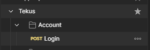
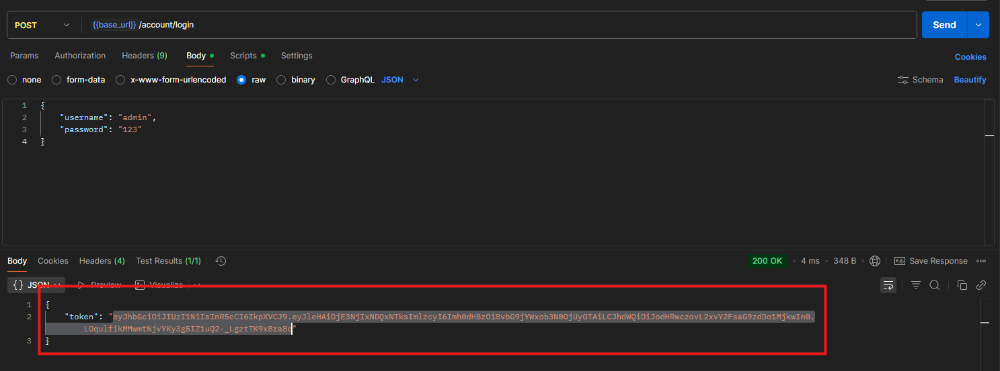
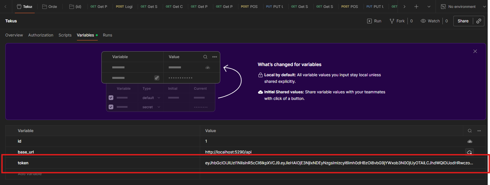

# Tekus Fullstack Test

## Arquitectura

### DDD simple con capas 
- Domain (Entities, Interfaces)
- Application (DTOs, Interfaces, Services)
- Infrastructure (BackgroundServices, External, Persistence, Repositories)
- Api (Controllers)

### Backend
.NET Core API REST con EF para SQL Server, auth con JWT, fetch externo para países (restcountries.com, sync a DB para persistencia).

### Frontend

React con Material UI, standalone componentes, integración con API vía axios con auth.

### Cumplimientos

- ✅ Países de servicio externo.
- ✅ Paginación/search con query params.
- ✅ Campos personalizados como JSON.
- ✅ Summary con 2 indicadores (providers/services por país con nombres).

## Cómo correr
1. DB: Ejecuta db/CreateDB.sql y db/SeedData.sql en SQL Server (localhost\SQLEXPRESS).
2. Backend: `cd src/Tekus.Api`, `dotnet run`
3. Frontend: `cd src/frontend`, `npm install`, `npm run dev`
4. Accede: localhost:5173/auth/login

## Endpoints

### [/api/account](docs/endpoints/Account.md)

### [/api/provider](docs/endpoints/Provider.md)

### [/api/service](docs/endpoints/Service.md)

### [/api/country](src/Tekus.Api/Controllers/CountryController.cs)

### [/api/summary](docs/endpoints/Summary.md)

También se cuenta con una colección de postman ([Tekus.postman_collection.json](docs/endpoints/Tekus.postman_collection.json)) lista para usar.

Para evitar el error 401 Unauthorized, primero se ejecuta el POST de Login

se copia el token que nos retorna y lo ponemos en la variable token de la colección.

_El token expira 1 hora despues de generado._

## Pruebas

- **Unitarias**: En `tests/Tekus.Tests` (xUnit para services).
  - Para correr las pruebas, desde la terminal usamos:
- **Integración**: Postman collection. [Tekus.postman_collection.json](docs/endpoints/Tekus.postman_collection.json)

## Pendientes

- Más tests (integración con Moq)
- Deploy a Azure

## Referencias

- Externo países: https://restcountries.com